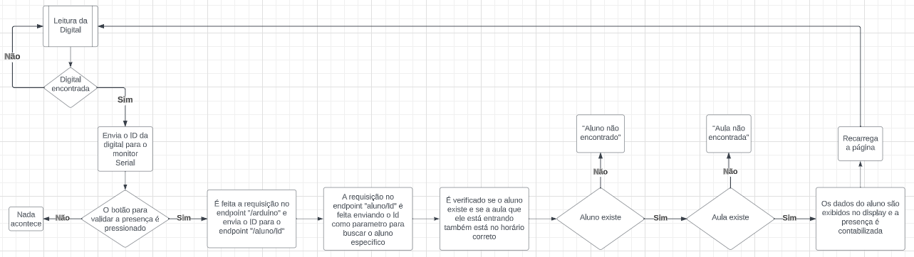
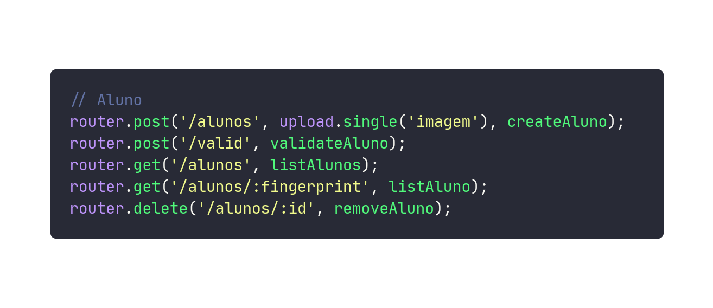

# COMPECH - Contador de Presença Tecnológico


## índice
- <a>Sobre o projeto</a>
- <a>Objetivo</a>
- <a>Tecnologias utilizadas</a>
- <a>Componentes utilizados</a>
- <a>Funcionalidades do projeto</a>
- <a>Como rodar o projeto</a>
- <a>Possíveis melhorias</a>

## Sobre o projeto - Descrição
  O presente projeto foi uma ideia para o TCC de um grupo da ETEC Júlio de Mesquita onde buscava-se solucionar o problema de contabulização de faltas e presenças dos alunos.

## Objetivo
  Esse projeto foi criado com a ideia de deixar as chamadas feitas em sala de aula mais rápidas, fazendo com que as aulas sejam mais dinâmicas. Por isso, esse sistema foi projetado para ser um contador de presença automático, através de biometria.

## Tecnologias utilizadas
- [NodeJs](https://nodejs.org/en)
- [ReactJS](https://react.dev/)
- [Typescript](https://www.typescriptlang.org/)
- [C++](https://cplusplus.com/)

### Principais Bibliotecas
- [serialport](https://serialport.io/) (NodeJs)
- [styled-components](https://styled-components.com/) (ReactJS)
- [prop-types](https://www.npmjs.com/package/prop-types) (ReactJS)
- [Adafruit_Fingerprint](https://www.arduino.cc/reference/en/libraries/adafruit-fingerprint-sensor-library/) (Arduino)

## Componentes utilizados
- Arduino
- Sensor Biométrico
- Display

## Funcionalidades do projeto

### Diagrama de funcionamento do Sensor Biométrico


### Diagrama da API


### Principais Rotas


### Funcionalidades em Diagrama

```
    class Aluno {
      +nome: String
      +imagem: String
      +rm: String
      +curso: String
      +fingerprint: String
      +sala: Schema.Types.ObjectId
    }

    class Aula {
      +diaSemana: String
      +horario: Number
      +horarioLimite: Number
      +alunos: Array
    }

    class SerialPort {
      +path: String
      +baudRate: Number
      <<singleton>>
    }

    class ReadlineParser {
      +delimiter: String
    }

    class Express {
      <<singleton>>
    }

    class Request
    class Response

    Aluno --|> Schema
    Aula --|> Schema
    Request --|> Express
    Response --|> Express
    Express --|> { listAluno, getFinger }

    Aluno *-- Aula : Sala reference
    listAluno --|> Aluno
    listAluno --|> Aula
    getFinger --|> Request
    getFinger --|> Response

    class FetchFunction {
      +fetch(url: String, options: Object): Promise
    }

    class ArduinoInterface {
      +port: SerialPort
      +parser: ReadlineParser
      +finger: String
    }

    FetchFunction --|> ArduinoInterface
    handleClick --|> FetchFunction
    handleClick --|> ArduinoInterface
```

## Como rodar o projeto

### Arduino
Antes de tudo, é necessário iniciar o sketch no Arduino, tendo as bibliotecas necessárias instaladas, pois a API precisa fazer conexão com o arduino. Caso quiser rodar sem o Arduino, é necessário comentar todas as linhas que se referem à conenão com ele.

### Back-end

```bash
# clonar o repositório
git clone https://github.com/augustosang/compech.git
# entrar na pasta api-compech
cd api-compech/

# instalar dependencias
yarn install

#executar o projeto
yarn dev
```

### Front-end
```bash
# entrar na pasta api-compech
cd frontend/

# instalar dependencias
yarn install

#executar o projeto
yarn dev
```

## Possíveis melhorias
  Para melhorar ainda mais o projeto, seria interessante a compra de um sensor biométrico ainda melhor que o utilizado e também um display touch, para a sua automação completa. No caso desse projeto, seus testes foram feitos utilizando apenas mouse e teclado para a interação com a tela.